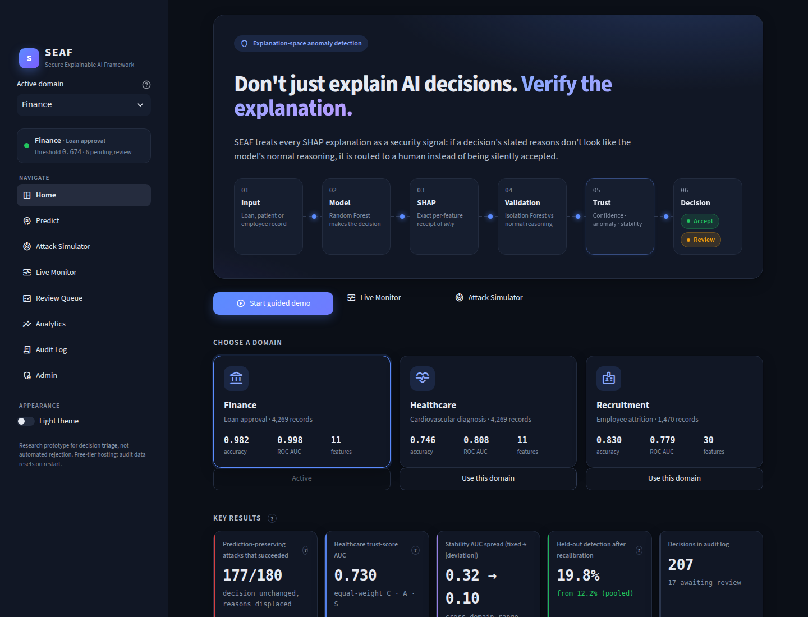
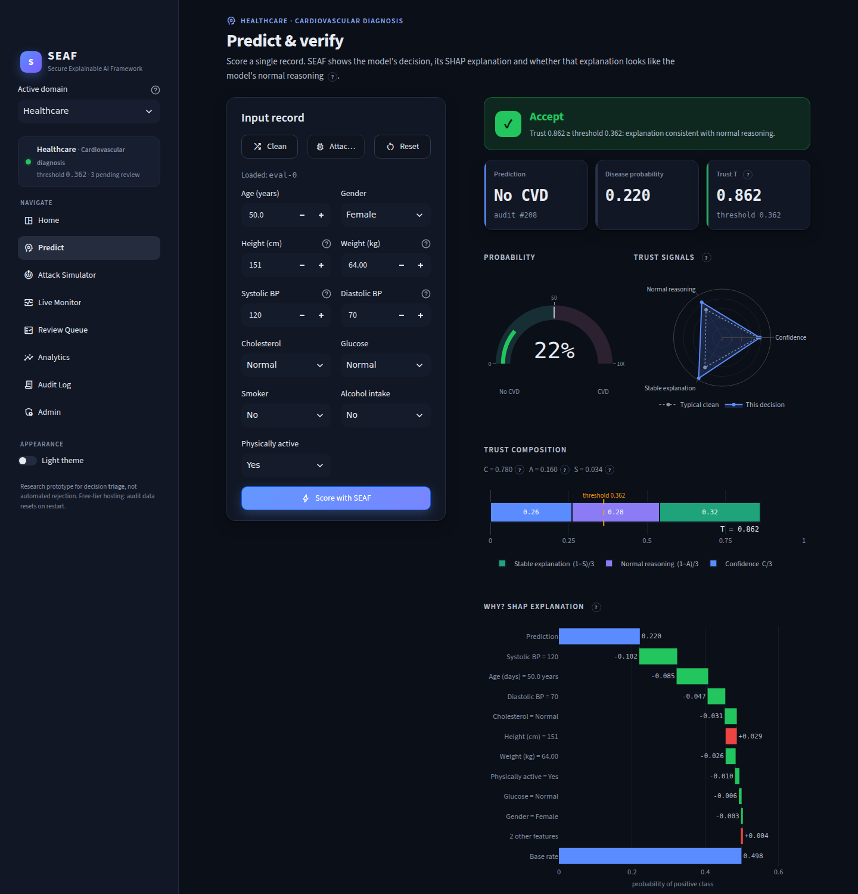
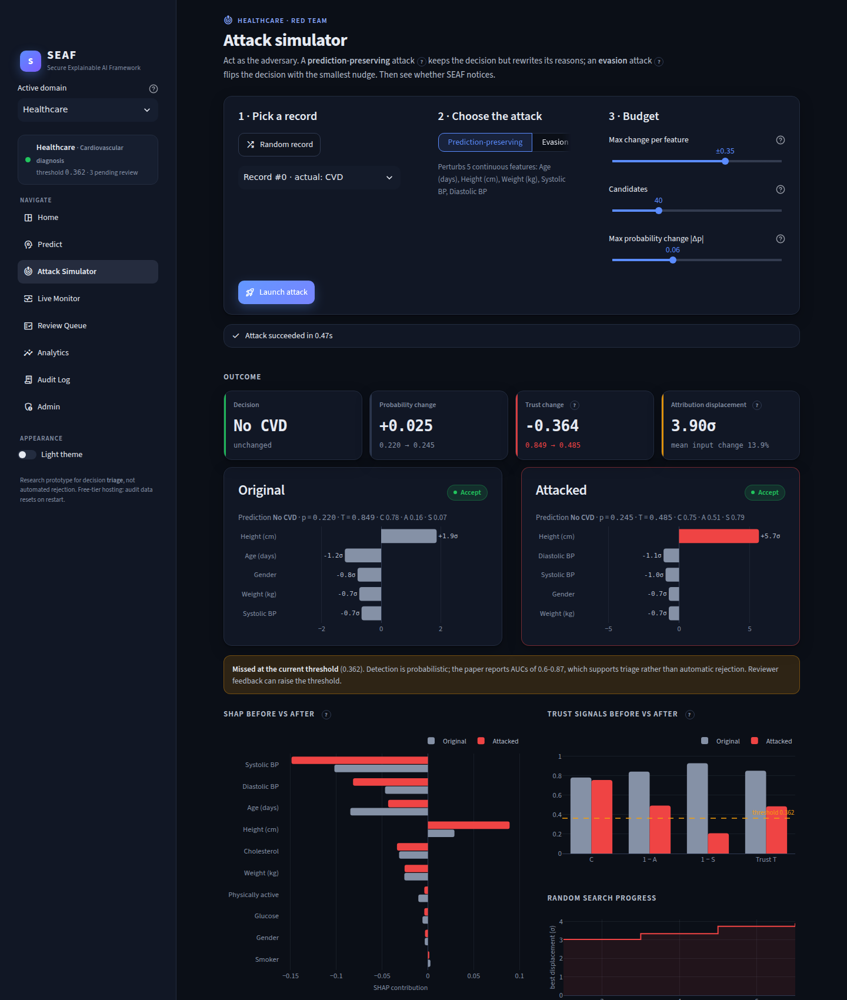
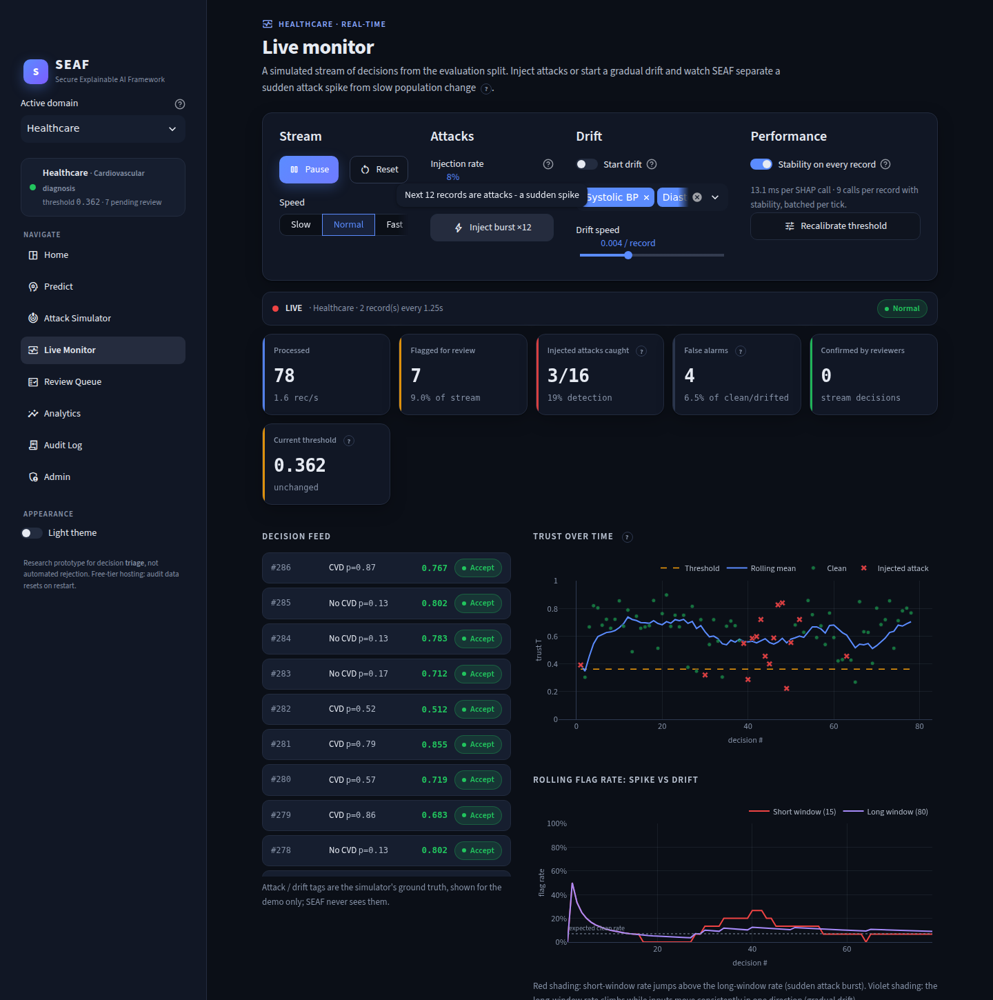
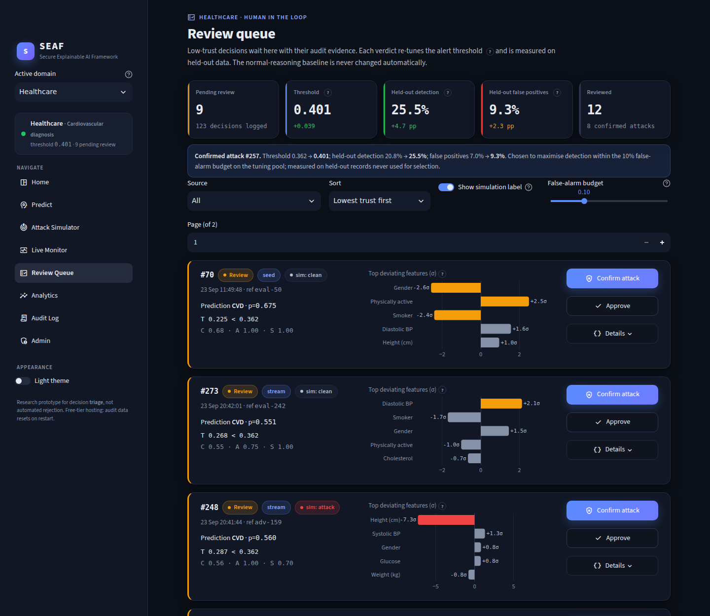
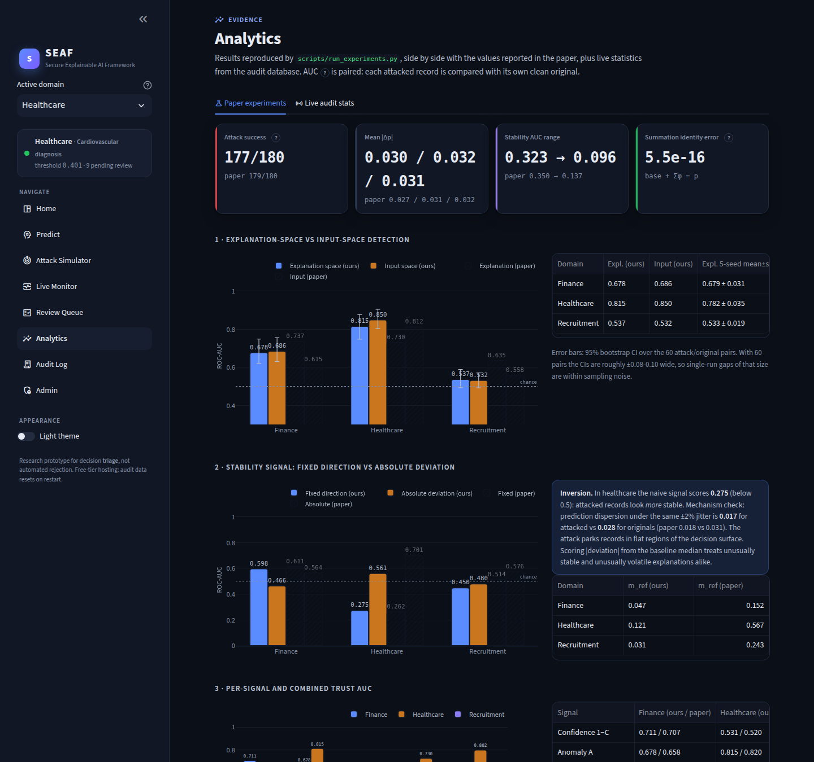
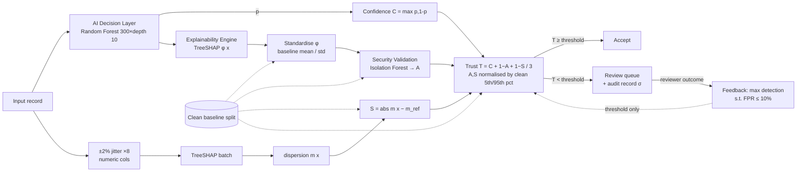

# SEAF: Secure Explainable AI Framework

**Explanation-space anomaly detection for securing machine-learning decisions.**
A Random Forest makes a decision → TreeSHAP explains it → an Isolation Forest checks whether that explanation looks
like the model's *normal reasoning* → a trust score combines confidence, anomaly and stability → low-trust decisions
go to a human review queue → confirmed outcomes recalibrate the alert threshold.

This repository implements the method of the paper *"Explanation-Space Anomaly Detection for Securing Machine
Learning Decisions: A Secure Explainable AI Framework (SEAF)"* as:

* a reusable, model-agnostic Python library (`seaf/`): `SEAF().fit(model, X_clean)` and `SEAF.score(X)`
* reproducible experiment scripts that regenerate the paper's tables (`scripts/`)
* an 8-page Streamlit security-operations dashboard with a live, simulated decision stream (`app.py`)
* free-tier deployment files for Hugging Face Spaces (Docker) and Streamlit Community Cloud

| Home | Predict |
|---|---|
|  |  |
| **Attack simulator** | **Live monitor** |
|  |  |
| **Review queue** | **Analytics** |
|  |  |

---

## Contents
1. [Architecture](#architecture)
2. [Quick start](#quick-start)
3. [Library API](#library-api)
4. [Data and protocol](#data-and-protocol)
5. [Reproducing the paper](#reproducing-the-paper-results-vs-paper)
6. [Dashboard and demo walkthrough](#dashboard-and-demo-walkthrough)
7. [Deployment (free tier)](#deployment-free-tier)
8. [Tests](#tests)
9. [Implementation notes and deviations](#implementation-notes-and-deviations)
10. [Limitations](#limitations)

---

## Architecture



The baseline (dashed) is estimated **only** from clean data and is **never** updated automatically from review
outcomes; only the threshold moves. A manual refit on reviewer-verified clean records is available on the Admin
page.

```
seaf/                 reusable library (type-hinted)
  preprocessing.py    loading, cleaning (cardio bounds), label encoding, 80/20 → baseline/eval splits
  model.py            RandomForest(n_estimators=300, max_depth=10), metrics
  explainer.py        TreeSHAP wrapper: old (list per class) and new (n, features, classes) layouts
  detector.py         per-dimension standardisation (baseline only) + IsolationForest
  stability.py        ±2% jitter on numeric columns, k=8, one batched SHAP call, |m − m_ref|
  trust.py            C, A, S, T with clean 5th/95th-percentile normalisation; top-σ deviations
  core.py             SEAF.fit / SEAF.score / SEAFResult.record (audit record)
  attack.py           prediction-preserving random search (40 cand., ±35%, |Δp| ≤ 0.06) + evasion
  feedback.py         threshold = max detection under FPR budget, measured on held-out data
  audit.py            SQLite audit log, review queue, threshold history
  stream.py           simulated live traffic with attack injection and gradual drift
  drift.py            rolling-window monitor: sudden spike vs gradual drift
  pipeline.py         identical build protocol for paper domains and uploaded CSVs
  artifacts.py        versioned, zlib-compressed bundles
scripts/
  train_all.py        train + fit baseline for all domains → artifacts/<domain>/
  run_experiments.py  reproduce the paper → results/experiments.json
  measure.py          memory / load-time / tree-count trade-off → results/deployment_metrics.json
  healthcheck.py      artifacts load, scoring works, DB writable (exit code)
app.py, app_pages/    Streamlit multipage app (st.navigation), ui/ = design system + shared state
assets/style.css      the single injected stylesheet; .streamlit/config.toml = theme
```

## Quick start

```bash
python -m venv .venv && source .venv/bin/activate        # Python 3.11
pip install -r requirements-dev.txt
streamlit run app.py                                      # uses the committed artifacts
```

Rebuild everything from the CSVs in `data/` (fixed seed 42 throughout):

```bash
python scripts/train_all.py            # ~6 min on 4 CPU cores → artifacts/<domain>/ (2.5–4 MB each)
python scripts/run_experiments.py      # ~9 min → results/experiments.json, results/paper_reference.json
python scripts/measure.py              # optional: memory and tree-count trade-off
pytest -q                              # 32 tests
```

## Library API

```python
from seaf import SEAF
from seaf.model import train_model

model, _ = train_model(X_train, y_train)                        # or any fitted sklearn tree ensemble
seaf = SEAF().fit(model, X_baseline, numeric_features=["income", "score", ...])

res = seaf.score(X_new)                  # batched: 1 SHAP call for originals + 8 jittered copies each
res.T, res.C, res.A, res.S, res.flagged  # vectors
res.record(0)["top_deviations"]          # audit record: top-5 features by |σ| deviation
seaf.score(X_new, stability=False)       # fast path: neutral S, marked stability_measured=False
seaf.refit_baseline(X_verified_clean)    # manual, returns a *new* SEAF
```

## Data and protocol

Phase-1 inspection of the three supplied CSVs (all match the paper; no missing values, no duplicates):

| Domain | File | Rows × cols | Target (positive) | Balance | Cleaning |
|---|---|---|---|---|---|
| Finance | `loan_approval_dataset.csv` | 4,269 × 13 | `loan_status` (**Rejected**) | 37.8% positive | strip whitespace in headers/values, drop `loan_id` → 11 features |
| Healthcare | `cardio_train.csv` (`;`-separated) | 70,000 × 13 | `cardio` (1) | 50.0% | drop `id`; keep systolic 80–200, diastolic 40–130, sys > dia, height 130–210, weight 35–180 → **68,492 kept, 1,508 dropped (exactly as in the paper)**; downsample to 4,269 (seed 42) → 11 features |
| Recruitment | `WA_Fn-UseC_-HR-Employee-Attrition.csv` | 1,470 × 35 | `Attrition` (Yes) | 16.1% | drop 3 constant columns (`EmployeeCount`, `Over18`, `StandardHours`) and the id `EmployeeNumber`; label-encode 7 categoricals; `class_weight="balanced"` → 30 features |

The positive class for finance is *Rejected* because the paper reports "predicted rejection probability" with base
rate 0.3775 (= 1,613 / 4,269); our Fig. 2 base value is **0.37747**.

Protocol (identical for every domain and for uploaded CSVs): stratified 80/20 train/test (seed 42) → test halved
into a **baseline** half (attribution scalers, Isolation Forest, stability reference, normalisation percentiles,
default threshold) and an **evaluation** half. The evaluation half is further split 50/50 into a *tuning* part
(threshold recalibration, live stream, demo records) and a *held-out* part that is only used to *measure*
detection/FPR and is never shown in the UI. "Numeric" (jittered / attacked) features are non-categorical columns with
more than 10 distinct values; integer columns are rounded after adversarial perturbation.

## Reproducing the paper: results vs paper

All numbers are from `results/experiments.json` (seed 42). Values in parentheses are the paper's. AUCs are
**paired** (each attacked record vs its own clean original, 60 attacked instances per domain).

**Protected models (Table II)**

| Domain | Accuracy | Precision | Recall | F1 | ROC-AUC |
|---|---|---|---|---|---|
| Finance | 0.9824 (0.9824) | 0.9873 (0.9873) | 0.9659 (0.9659) | 0.9765 (0.9765) | 0.9975 (0.9975) |
| Healthcare | 0.7459 (0.7447) | 0.7811 (0.7790) | 0.6800 (0.6800) | 0.7270 (0.7261) | 0.8077 (0.8101) |
| Recruitment | 0.8299 (0.8333) | 0.4615 (0.4167) | 0.3830 (0.1064) | 0.4186 (0.1695) | 0.7792 (0.7873) |

Finance is an exact match and healthcare is within one record (identical TP/FN). The recruitment gap is explained
below.

**Attack**: 177/180 prediction-preserving attacks succeeded (paper 179/180); mean |Δp| 0.030 / 0.032 / 0.031
(paper 0.027 / 0.031 / 0.032); predicted class preserved in 100% of successes.

**Explanation-space vs input-space detection (Table IV)**

| Domain | Explanation (ours) [95% CI] | Input (ours) [95% CI] | 5-seed mean expl / input | Paper expl / input |
|---|---|---|---|---|
| Finance | 0.678 [0.62–0.75] | 0.686 [0.63–0.76] | **0.679 / 0.609** | 0.737 / 0.615 |
| Healthcare | 0.815 [0.75–0.88] | 0.850 [0.80–0.90] | **0.782 / 0.830** | 0.730 / 0.812 |
| Recruitment | 0.537 [0.49–0.59] | 0.532 [0.49–0.57] | 0.533 / 0.538 | 0.635 / 0.558 |
| Recruitment, *unweighted model* | **0.628** | **0.558** | | 0.635 / 0.558 |

**Stability signal (Table V)**

| Domain | Fixed-direction (ours / paper) | Absolute-deviation (ours / paper) | m_ref (ours / paper) |
|---|---|---|---|
| Finance | 0.598 / 0.611 | 0.466 / 0.564 | 0.047 / 0.152 |
| Healthcare | **0.275 / 0.262** | 0.561 / 0.701 | 0.121 / 0.567 |
| Recruitment | 0.450 / 0.514 | 0.480 / 0.576 | 0.031 / 0.243 |
| Cross-domain range | 0.323 / 0.350 | **0.096 / 0.137** | |

Mechanism check (healthcare): prediction dispersion under identical ±2% jitter is **0.017** for attacked records vs
**0.028** for their originals (paper 0.018 vs 0.031). Attacked records sit in flatter regions of the decision surface.

**Per-signal and combined trust (Table VI)**

| Signal | Finance | Healthcare | Recruitment |
|---|---|---|---|
| Confidence (1−C) | 0.711 (0.707) | 0.531 (0.520) | 0.520 (0.591) |
| Anomaly A | 0.678 (0.658) | 0.815 (0.820) | 0.538 (0.547) |
| Stability S | 0.465 (0.579) | 0.561 (0.721) | 0.480 (0.645) |
| Equal-weight trust | 0.640 (0.635) | 0.730 (0.870) | 0.492 (0.614) |
| Fitted trust (5-fold LR) | 0.644 (0.621) | 0.802 (0.851) | 0.461 (0.635) |
| *Recruitment, unweighted model: equal-weight trust* | | | **0.614 (0.614)** |

**Feedback loop (§4.6)**: default threshold = 5th percentile of clean-baseline trust; recalibration maximises
detection within a 10% FPR budget on the tuning half, measured on held-out records. Pooled over the three domains,
held-out detection rises **12.2% → 19.8%** at FPR **6.8% → 12.2%** (paper 10% → 40%, FPR 5% → 13%). By domain:
finance 6.5% → 19.6% (FPR 5.6% → 15.9%), healthcare 20.8% → 25.5% (7.0% → 9.3%), recruitment unchanged at 4.1%
(default FPR already 9.5%, so there was no budget left). As in the paper, held-out FPR can exceed the nominal budget
because the threshold is chosen on a finite sample.

**Baseline contamination**: explanation-space AUC declines gradually as wrongly cleared attacks are appended to the
baseline. Healthcare: 0.815 → 0.797 (2–6%) → 0.746 (18%) → 0.668 (47%) → 0.625 (99%). Finance falls only
0.678 → 0.656. That matches the paper's conclusion: occasional review errors are tolerable, systematic ones are not.

### Why some numbers differ, and what I did *not* do

I did not tune anything to match the paper. The differences have concrete explanations:

1. **Recruitment used an unweighted model in the paper.** With `class_weight="balanced"`, as specified, recall is
   0.383. Retraining *without* class weights reproduces the paper's Table II almost exactly (TN/FP/FN/TP 240/7/41/6
   vs paper 240/7/42/5; AUC 0.7874 vs 0.7873). On that model the paired AUCs become 0.628 vs 0.558 (paper
   0.635 vs 0.558) and trust AUC 0.614 (paper 0.614). This strongly suggests the paper's recruitment experiments
   ran without effective class weighting. The app keeps `balanced` per spec; `python scripts/train_all.py
   recruitment --no-balance` builds the paper-faithful variant.
2. **Sampling noise is large.** With 60 pairs, 95% bootstrap CIs are about ±0.06–0.07 wide. Re-drawing the 60
   instances over five seeds moves finance from a tie (0.678 vs 0.686 for seed 42) to explanation > input on
   average (**0.679 vs 0.609**, paper 0.737 vs 0.615). The directional findings reproduce: explanation-space wins
   where features are unbounded (finance) and loses where they are physiologically bounded (healthcare).
3. **Stability dispersion scale.** The paper's reference dispersions (0.15–0.57) are only consistent with
   attributions measured in baseline-σ units, so dispersion is computed on standardised attributions. Our m_ref
   values are still 3–8× smaller but preserve the paper's ordering (healthcare highest). The paper does not state
   the exact scaling. The inversion (fixed-direction 0.275) and the variance reduction (range 0.323 → 0.096)
   reproduce; the absolute-deviation AUCs are lower than reported.
4. **Isolation Forest is affine-invariant.** scikit-learn's Isolation Forest draws each split uniformly between the
   node's min and max of one feature, so per-dimension standardisation leaves its scores **exactly unchanged**
   (verified in `tests/test_seaf.py`). The paper's §3.7 rationale for standardising therefore doesn't hold for this
   detector. Standardisation is kept because it defines the σ audit record, the attack's displacement objective
   and the stability dispersion.
5. **Unstated details** (attack feature set, integer rounding, IF size = 200 trees, jitter RNG) are documented in
   code comments; each plausibly shifts AUCs by a few hundredths at n = 60.

## Dashboard and demo walkthrough

| Page | What it shows |
|---|---|
| **Home** | hero, animated pipeline (Input → Model → SHAP → Validation → Trust → Accept/Review), domain cards, key results, **Guided demo** |
| **Predict** | editable record form → verdict badge, probability gauge, trust radar + segmented C/A/S bar, SHAP waterfall with summation identity, top-σ audit evidence |
| **Attack Simulator** | prediction-preserving or evasion attack with live progress; original vs attacked: Δp, ΔT, displacement σ, SHAP before/after, trust before/after, random-search trace, highlighted feature-diff table |
| **Live Monitor** | start/pause/speed, injection-rate slider, *Inject burst*, *Start drift* on chosen features; scrolling feed, KPIs, trust-over-time, rolling flag-rate with spike/drift shading, toasts. Only the `st.fragment(run_every=…)` panel reruns |
| **Review Queue** | flagged cards with σ mini-charts; **Confirm attack / Approve** recalibrate the threshold immediately with before/after deltas (held-out detection and FPR) |
| **Analytics** | all paper experiments vs paper values (CIs, 5-seed spread), plus live audit-DB statistics and threshold history |
| **Audit Log** | searchable / filterable table (domain, verdict, status, source, dates, trust range), row drill-down, CSV export |
| **Admin** | health (memory, versions, artifacts), manual threshold control, **refit baseline on reviewer-verified records only**, **upload a CSV → build model + baseline** (≤ 5 MB, ≤ 3,000 rows, ≤ 40 features) |

Plain-language `?` tooltips explain SHAP, trust score, σ deviation, AUC, FPR, drift and so on for non-technical
examiners. The dark theme is the default; there's a light theme toggle in the sidebar.

**Viva script (≈5 min)**
1. *Home → Start guided demo* (finance): (1) a normal decision is accepted, with the SHAP receipt summing exactly to
   p; (2) the attack keeps the decision while the explanation shifts; (3) SEAF flags it, trust drops, σ evidence
   appears; (4) *Confirm attack*; (5) the threshold recalibrates (0.419 → 0.674, held-out detection +13 pp, FPR cost
   shown).
2. *Attack Simulator*: launch a few attacks. Some are caught, some slip through; explain triage vs automatic rejection.
3. *Sidebar → Healthcare*, *Live Monitor → Start*, then *Inject burst ×20* (red spike shading, toast), then
   *Start drift* on systolic/diastolic BP (violet drift shading once the shift is consistent).
4. *Review Queue*: confirm or approve a few items and watch the threshold, detection and FPR deltas.
5. *Analytics*: the reproduced tables vs the paper, including the stability inversion and the recruitment finding.

## Deployment (free tier)

### What the free tiers offer (checked September 2026)
| | Hugging Face Spaces, CPU basic (**primary**) | Streamlit Community Cloud (fallback) |
|---|---|---|
| Hardware | 2 vCPU, 16 GB RAM, ~50 GB **ephemeral** disk | shared; ≈ 0.078–2 CPU, **≈ 690 MB–2.7 GB RAM** |
| Sleep | after **48 h** without traffic; the next visit restarts it (cold start) | after **12 h** without traffic; visitor clicks "wake up" |
| Streamlit | the built-in Streamlit SDK is **deprecated**; use the **Docker SDK** (this repo's `Dockerfile`) | native; Python version picked in *Advanced settings* at deploy time |
| Persistence | none by default (paid add-on) | none |

Sources: [HF Spaces overview](https://huggingface.co/docs/hub/en/spaces-overview),
[HF Streamlit SDK note](https://huggingface.co/docs/hub/en/spaces-sdks-streamlit),
[Streamlit: manage your app](https://docs.streamlit.io/deploy/streamlit-community-cloud/manage-your-app),
[Streamlit resource limits](https://discuss.streamlit.io/t/common-app-problems-resource-limits/16969).
These limits change, so check the pages before a submission deadline.

### Measured footprint (this repo)
| Metric | Value |
|---|---|
| Artifacts (3 domains, zlib-compressed) | 2.5 + 4.0 + 2.5 MB = **8.9 MB** (each < 10 MB, so no Git LFS needed) |
| Docker image | 1.47 GB (python:3.11-slim + scientific stack) |
| Container RAM after visiting all 8 pages | **220 MiB** (`docker stats`) |
| Local Streamlit process, one domain loaded | 355 MB RSS; each extra domain ≈ +30 MB; at most **2** domain bundles resident (`st.cache_resource(max_entries=2)`) |
| Cold start → `/_stcore/health` OK | ≈ 5 s; first page render ≈ 2.5–3 s; other pages 0.5–1.4 s |
| Domain bundle load (incl. TreeExplainer build) | 0.15–0.22 s |
| Score one record incl. stability (9 SHAP evals, 1 batch) | 57 ms finance · 127 ms healthcare · 98 ms recruitment |

**Tree-count trade-off** (`results/deployment_metrics.json`):

| Domain | Trees | Accuracy | ROC-AUC | Model size | SHAP ms/record |
|---|---|---|---|---|---|
| Finance | 100 / 300 | 0.9813 / 0.9824 | 0.9969 / 0.9975 | 0.30 / 0.86 MB | 1.3 / 3.4 |
| Healthcare | 100 / 300 | 0.7412 / 0.7459 | 0.8051 / 0.8077 | 0.91 / 2.67 MB | 4.6 / 13.1 |
| Recruitment | 100 / 300 | 0.8299 / 0.8299 | 0.7746 / 0.7792 | 0.42 / 1.27 MB | 2.4 / 9.3 |

100 trees would cut size and SHAP time about 3× for a ≤ 0.005 loss in accuracy/AUC. Memory is nowhere near the
limit on either platform, so the paper's **300 trees are kept** (method fidelity). If Streamlit Cloud ever runs short
of RAM, `python scripts/train_all.py --trees 100` is the lever.

### Design choices for free hosting
* **No training at start-up.** Artifacts are committed; the Docker build only trains if they are missing; `app.py`
  trains only as a last-resort fallback with a progress panel.
* **Lazy domains.** A domain loads on first use; at most two are cached. The TreeExplainer is not pickled; it's
  rebuilt (≈ 0.1 s) inside the cache.
* **Batched SHAP.** Stability's k = 8 jittered copies are explained in the same SHAP call as the originals. The
  Live Monitor scores 1–4 records per tick in one call, with an optional "stability every 3rd record" fast mode.
* **Ephemeral storage.** SQLite lives in `$SEAF_RUNTIME_DIR` (`/tmp/seaf` in Docker; `runtime/` locally). On every
  (re)start the DB is **re-seeded with demo decisions** (42 per domain, including flagged ones), so the Review Queue
  and Analytics are never empty. ⚠️ **Reviews, refits and uploaded datasets do not persist on the free tiers.**
* **Health and errors.** Streamlit's `/_stcore/health` backs the Docker `HEALTHCHECK`;
  `python scripts/healthcheck.py` checks artifacts, scoring and the DB. Page errors are caught and shown as a short
  message (`client.showErrorDetails = "none"`), not a stack trace.
* No secrets, no paid services.

### A. Hugging Face Spaces (Docker SDK), primary
1. Create a Space at <https://huggingface.co/new-space>: choose **Docker** → **Blank**, hardware **CPU basic (free)**.
2. Push this repository to the Space (the YAML header at the top of this README configures it: `sdk: docker`,
   `app_port: 7860`):
   ```bash
   git remote add space https://huggingface.co/spaces/<your-user>/<space-name>
   git push space claude/vibrant-goldberg-e8x8q3:main      # or your main branch
   ```
   (Use an HF access token with *write* scope as the password. All files are < 10 MB, so no LFS is needed.)
3. Wait for the build (~3–5 min). The Space log shows `You can now view your Streamlit app`, and the health check
   turns green.
4. Optional: *Settings → Sleep time* stays at the free default (48 h). After a sleep, the first visitor waits for
   a cold start (~10–30 s on HF).

Local equivalent: `docker build -t seaf . && docker run -p 7860:7860 seaf` → <http://localhost:7860>.

### B. Streamlit Community Cloud, fallback
1. Push the repository to GitHub (public, or private with the Streamlit app authorised).
2. Go to <https://share.streamlit.io> → **Create app** → pick the repo/branch, **Main file path** `app.py`.
3. **Advanced settings → Python version 3.11** (Community Cloud ignores `runtime.txt`; it's provided for other
   hosts). No secrets are needed.
4. Deploy. Requirements install from `requirements.txt` (~3 min). The app then sleeps after 12 h idle.

## Tests

```bash
pytest -q          # 32 tests, ~7 s
```
They cover: the SHAP summation identity (toy model and shipped finance model, including base rate 0.3775), both SHAP
output layouts, trust ∈ [0, 1] even on extreme inputs, the T formula, **normalisation from the clean baseline only**
(and not moved by scoring), jitter touching numeric columns only (±2%) deterministically, the non-directional
stability signal, **attack preserves class** with |Δp| ≤ 0.06 and ±35% on numeric features only, evasion flips the
class, Isolation Forest affine invariance, the threshold rule respecting the FPR budget, audit-DB round trip, drift
monitor spike detection, the paper's data shapes (1,508 cardio rows dropped, 7 categoricals, 3 constants), and
**every app page rendering** via Streamlit `AppTest`.

## Implementation notes and deviations
* Identifier columns (`loan_id`, `id`, `EmployeeNumber`) are dropped. The finance count (11 attributions) and the
  recruitment metrics indicate the paper did the same.
* Stability jitter is seeded per record (seed + CRC of the row), so a record always gets the same S whatever batch
  it is scored in.
* Fitted-trust weights are on the *suspicion* components (1−C, A, S), which matches the paper's sign
  interpretation.
* Threshold recalibration breaks ties towards the lowest threshold that reaches the maximum detection (fewest false
  positives), so confirmed attacks can move the threshold. It never changes the baseline.
* Contamination "level" = wrongly cleared attacks **appended** to the baseline, relative to baseline size.
* The Live Monitor's temporal detector (`seaf/drift.py`) is an extension the paper names as future work. It
  flags a *spike* when the recent flag rate or mean trust departs abruptly from the preceding window, and *drift*
  when the mean of standardised inputs moves consistently from where the stream started. Random-sign attack edits
  average out; population drift does not.

## Limitations
* **Detection is moderate** (paired AUC ≈ 0.64–0.82 where it works, ≈ 0.5 for recruitment with a balanced model).
  SEAF supports **triage**, not automated rejection, and the UI says so.
* Recruitment: with class weighting, neither explanation- nor input-space detection beats chance at n = 60.
  Detection quality depends on the protected model, as the paper notes.
* One attack family (unaware black-box random search). An adaptive attacker that also minimises the anomaly score
  was not evaluated. The explainer is assumed honest (no scaffolding defence).
* Burst detection in the monitor is only as good as per-record separation: clear in healthcare, weak in finance,
  absent in recruitment.
* Small evaluation samples (60 attacks per domain) give wide CIs; see the bootstrap and 5-seed spreads above.
* Free-tier hosting: ephemeral state, cold starts after sleep, and one shared audit DB for all visitors.
* TreeSHAP restricts the shipped models to tree ensembles; the library's interfaces are model-agnostic in principle.
